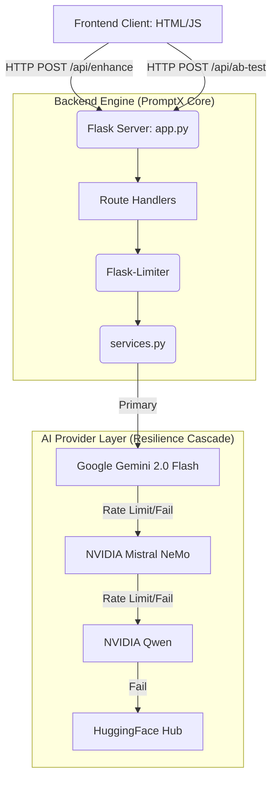

# 🏗️ PromptX System Design Specification

**PromptX** is a local, AI-powered prompt engineering gateway designed to help developers enhance, refine, and A/B test system prompts using high-tier Large Language Models (LLMs) from Google Gemini, NVIDIA NIM, and Hugging Face.

---

## 🏛️ 1. High-Level Architecture

The architecture follows a classic Client-Server (Frontend-Backend) decoupling, completely self-hosted, emphasizing rapid context generation, strict JSON error handling, and highly resilient API fallback cascades.

---

## 🖥️ 2. Frontend Layer (UI/UX)
**Path:** `/frontend/`  
**Stack:** Vanilla JavaScript, HTML5, Vanilla CSS

The User Interface mimics a premium chat environment (similar to ChatGPT and Claude) optimized for long-form prompt input. 

### Key Features:
1. **Dynamic Model Selection:** Custom Lucide-icon dropdown seamlessly switches prompt enhancement modes between "Detailed" and "Structured".
2. **Auto-Scrolling Chat Window:** Input box pinned to the bottom allowing the message history to scroll above it endlessly.
3. **Auto-Save History (`localStorage`):** The last 50 prompts and responses are serialized into the browser's persistent cache.
4. **Explicit UI Error Handling:** Emits `400 Bad Request` and `429 Too Many Requests` API failures directly into the chat flow rather than silently dropping them.

---

## ⚙️ 3. Backend Layer (Core Engine)
**Path:** `app.py`, `services.py` 
**Stack:** Python 3.8+, Flask, Requests, google-genai

The backend is a purely stateless processing pipe bridging the frontend and massive Cloud ML APIs.

### `app.py` (API Gateway)
*   **Routing:** Defines `/api/enhance` (single prompt optimization) and `/api/ab-test` (multi-variation generation).
*   **Robust Deserialization:** Utilizes `request.get_json(force=True, silent=True)` to prevent strict JSON header crashes.
*   **Rate Limiting:** In-memory tracking (`flask-limiter`) capping execution to prevent localized spamming and API billing exhaustion.
*   **Scale Limits:** Ingests up to 100,000 characters per prompt.

### `services.py` (AI Orchestrator)
Handles the highly sensitive logic for building structured prompts and managing cascading AI failures.

*   **Sequential vs Parallel Execution:** `ab_test` logic is processed sequentially to prevent `429 RESOURCE_EXHAUSTED` faults which parallel execution previously triggered on NIM free tiers.
*   **Prompt Constraints Engine:** Injects markdown system rules requiring the prompt output to include Mermaid.js diagrams, architecture maps, and system role behaviors.
*   **Resiliency Cascade (Multi-Model Handover):**
    1.  **Attempt 1:** Gemini API
    2.  **Fallback 1:** NVIDIA Mistral
    3.  **Fallback 2:** NVIDIA Qwen
    4.  **Fallback 3:** HuggingFace Inference API
*   **NoneType Security:** Implements rigorous `.get()` checks to prevent the server crashing when non-conforming responses (e.g. `reasoning_content` fields) are returned by third-party APIs.

---

## 🚀 4. CLI Boot System (Developer Experience)
**Path:** `setup.sh`, `start.sh`  
**Stack:** Bash, ANSI Escape Codes, Linux subshells

A state-of-the-art startup sequence built for maximum developer joy. 

*   **Custom ASCII Art:** Instantiates a massive, intricately mapped AI Bot Face graphic combining `Cyan`, `Light Purple`, and `Deep Blue` gradients.
*   **Pre-flight UX Hooks:** Employs animated loading spinners for background dependency installation tasks, evaluating port (`:5000`) bindings, and validating the `.env` configuration.
*   **Graceful Termination:** Binds `cleanup()` traps to `SIGINT/SIGTERM`, ensuring background tasks and subshells terminate without isolating orphaned Python processes.

---

## 🔒 5. Data Flow & Security Constraints

1.  **No Server-Side State:** All prompt history is retained explicitly client-side via `localStorage`. The backend keeps 0 logs of user prompts to preserve data privacy.
2.  **Secret Integrity:** `GEMINI_API_KEY`, `NVIDIA_MISTRAL_API_KEY`, `NVIDIA_QWEN_API_KEY`, and `HUGGINGFACE_API_KEY` exist strictly in runtime environments.
3.  **CORS Safety:** The current architecture assumes `flask-cors` binds to local resources. Future production deployment must lock `origins` to the approved frontend domain.

---

## 🛠️ 6. Deployment Strategy

The application is structured to easily deploy across decoupled providers:
*   **Frontend:** Vercel (using `vercel.json` routing configuration).
*   **Backend:** Dedicated Python hosting strategy (e.g., Render or Azure App Services). Redis would replace the `memory://` store for robust global rate-limiting.